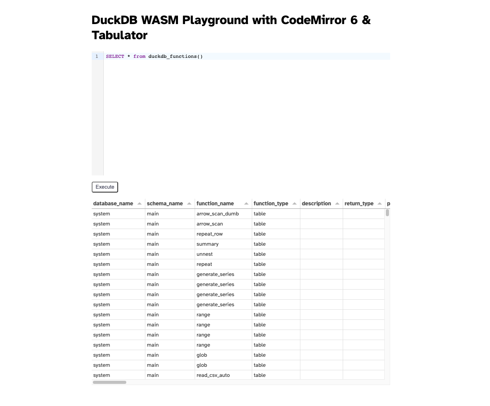

# DuckDB-Wasm + CodeMirror 6 + Tabulator + SvelteKit



A simple svelte-kit app to show loading DuckDB-Wasm, CodeMirror 6, and Tabulator using svelte-kit.

Run locally:

```bash
git clone https://github.com/sekuel/duckdb-wasm-codemirror-tabulator-svelte.git
cd duckdb-wasm-codemirror-tabulator-svelte
npm i
npm run dev
```